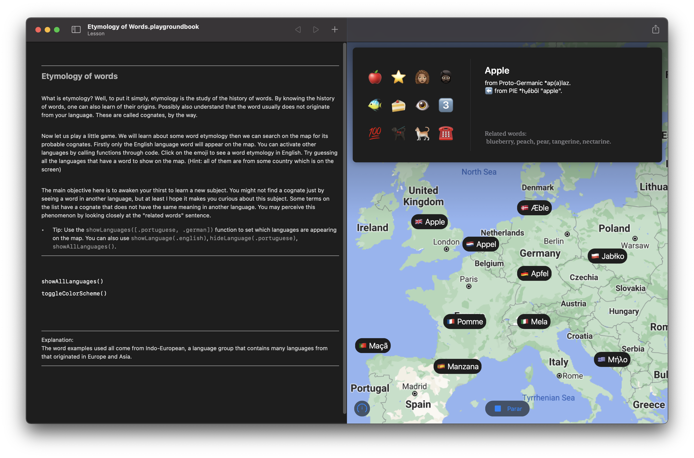

# Etymology of Words

### Swift Playgroundbook made by Thiago Nitschke Simões for WWDC21 Swift Student Challenge.

## Introduction

This playground book consists of a simple browsing book, made more interactive, letting the user interact with it to discover which words may or may not have a common origin. It introduces the topic of a word's etymology in a ludic way. I used SwfitUI and NaturalLanguage frameworks to develop this project.

## Download

To experience this project, download the ".playgroundbook" file in this repository, and open it using Swift Playgrounds 3.4 or above for macOS (you can also use Playgrounds for iPad).

## Author

Hi there! My name is Thiago Nitschke Simões. I'm into tech and games, also having a great love for linguistics, design, and culture in general. Jobwise, I'm an iOS developer, especially excited about making apps and games that have a wow factor.

If you want to find out more about me, please visit my [LinkedIn](https://www.linkedin.com/in/thiago-nitschke-sim%C3%B5es-844a88b6/) or [GitHub](https://github.com/thnitschke) profile.
